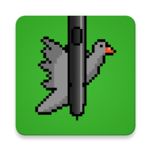

  

# Bird Hunt
Bird Hunt is an attempt to create a simple game using the [S Pen Remote SDK](https://developer.samsung.com/galaxy-spen-remote/s-pen-remote-sdk.html). The game takes advantage of the gyroscope in the S Pen, available on certain Galaxy devices, to move the crosshair, simulating the effect of aiming a gun at the phone’s screen.

This game is more of a Proof of Concept/Tech Demo rather than a full-fledged game. The S Pen wasn't really designed for motion controls in games, so expect some bugs related to controls, random disconnects, and other issues. The S Pen SDK used here was last updated by Samsung 5 years ago, and they've removed this functionality in their latest devices. So if the game isn't working properly on your Galaxy device now, unfortunately, it's never gonna work any better.

The game was written in Kotlin using the [libGDX framework](https://github.com/libgdx/libgdx)

## Supported devices
<ins>**This game works ONLY on Samsung phones that have an S Pen with [Air Actions](https://www.samsung.com/us/support/answer/ANS10003221/) functionality.**</ins> Even if your device has a stylus but is not a Samsung device, the game will not work, as it uses Samsung's SDK specifically for S Pen.
- Samsung Galaxy Note Series: **Galaxy Note10**
- Samsung Galaxy S Ultra Series: **Galaxy S20-S24 Ultra**
- Samsung Galaxy Tab Series: **Galaxy Tab S6** and newer *(Air Actions depend on the specific S Pen model)*

It also requires Android 12 or newer. 
But like I said earlier, whether the game works on your device is kinda random. It might, but it also might not.